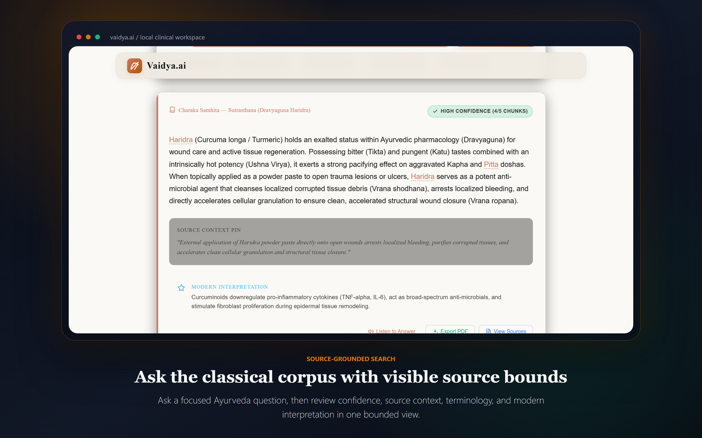
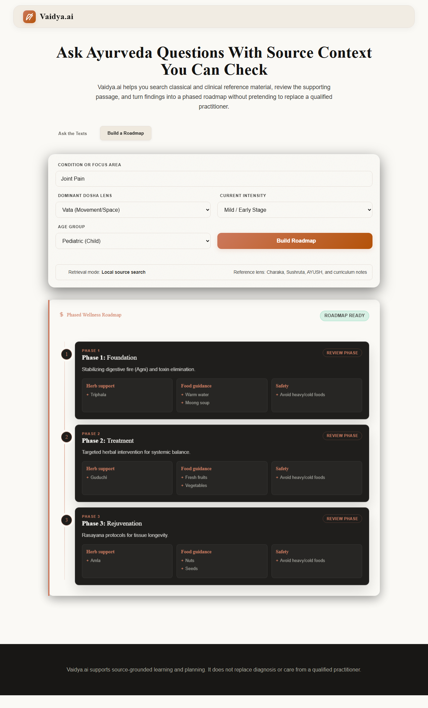
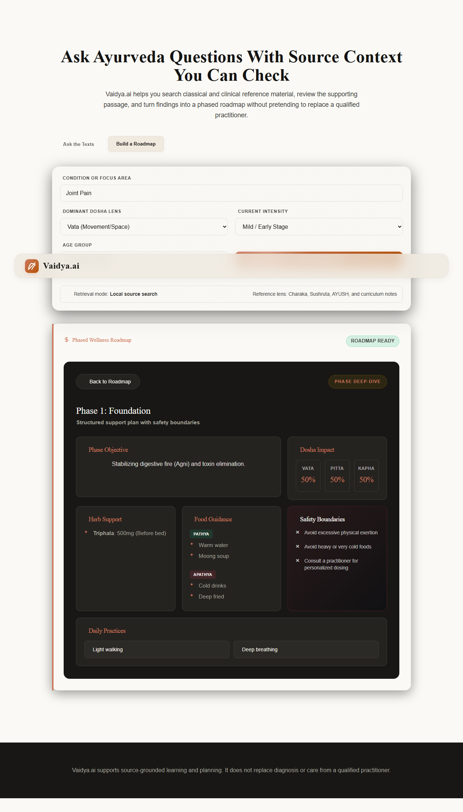
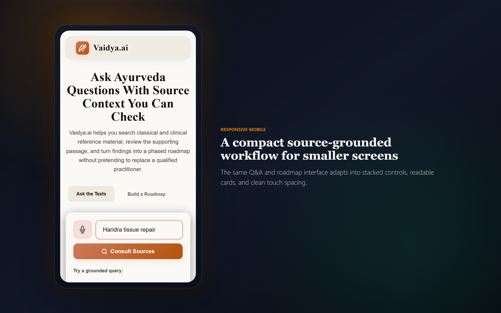

# Vaidya.ai

Source-grounded Ayurveda Q&A with inspectable answers, confidence signals, and phased roadmap support.

[Live Demo](https://vaidya-pi.vercel.app/) | [Screenshots](#product-screenshots) | [Local Setup](#local-setup) | [Deployment](#deployment)

Vaidya.ai is a web prototype for asking questions against curated Ayurveda reference material. It pairs a FastAPI retrieval backend with a polished static frontend so users can ask focused questions, inspect the supporting source context, and generate structured roadmap-style guidance.

This project is intended for educational and prototype review. It does not provide medical diagnosis or replace a qualified practitioner.

## Why It Exists

Ayurveda knowledge is spread across classical texts, curriculum notes, and clinical reference material. That makes it hard to search, compare, and audit. Generic chatbots can also produce unsupported answers when domain context is missing.

Vaidya.ai takes a stricter approach:

- Search local reference material before answering.
- Show confidence and corroboration signals.
- Pin source context beside the generated response.
- Highlight important Sanskrit and clinical terms.
- Keep roadmap guidance structured and reviewable.

## Core Workflows

### Ask the Texts

Ask a question about a concept, herb, symptom pattern, or care principle. The app returns a source-grounded answer with confidence tier, extracted entities, source context, and a modern interpretation.

### Build a Roadmap

Enter a condition or focus area, select a dosha lens, severity, and age group, then generate a three-phase roadmap. Each phase opens into bento-style detail cards covering objective, herbs, food guidance, dosha impact, safety boundaries, and lifestyle tasks.

### Export and Review

For supported answer views, the app can generate a PDF-style clinical analysis report for easier review and sharing.

## Key Features

- **Hybrid retrieval engine** - Uses local text ingestion and vector-style matching over curated Ayurveda references.
- **Confidence-tiered responses** - Surfaces high, moderate, or low confidence based on retrieved corroboration.
- **Source context pins** - Keeps the supporting passage visible so users can audit the response.
- **Sanskrit entity highlights** - Detects terms such as Vata, Pitta, Kapha, Haridra, and Sattva with inline definitions.
- **Roadmap timeline** - Converts a condition and dosha lens into a readable phased plan.
- **Bento phase details** - Splits each phase into compact cards for objective, herbs, food, safety, and daily practices.
- **Voice controls** - Uses browser speech APIs for voice input and text-to-speech where supported.
- **Vercel-ready deployment** - Includes `vercel.json`, `requirements.txt`, and `.vercelignore`.

## Product Screenshots

### Source-Grounded Search



Ask a focused Ayurveda question and review the generated answer beside confidence, source context, terminology highlights, and modern interpretation.

### Roadmap Timeline



Convert a condition and dosha lens into a staged roadmap with objective, herb support, food guidance, and safety previews for each phase.

### Roadmap Deep-Dive



Open any roadmap phase into bento-style clinical cards that separate objectives, dosha impact, herbs, diet, safeguards, and daily practices.

### Mobile Layout



Use the same source-grounded search and roadmap workflow on smaller screens with stacked controls and readable touch spacing.

## Tech Stack

- **Backend:** FastAPI, Pydantic, Uvicorn
- **Retrieval:** Local text corpus, NumPy, TF-IDF-style scoring
- **LLM client:** OpenAI-compatible client, configured for OpenRouter by default
- **Frontend:** Vanilla HTML, CSS, JavaScript
- **Reports:** ReportLab PDF generation
- **Deployment:** Vercel Python serverless routing

## Architecture

```txt
User question or roadmap request
        |
        v
FastAPI endpoint
        |
        v
Local retrieval over curated Ayurveda data
        |
        v
Confidence tier + source context selection
        |
        v
Fallback response or OpenAI-compatible JSON synthesis
        |
        v
Static frontend renders answer, citations, roadmap, and bento cards
```

The frontend is served from `frontend/` by the FastAPI app mounted at `/`. API routes such as `/api/query`, `/api/roadmap`, and `/api/export-pdf` are handled before the static frontend fallback.

## Project Structure

```txt
backend/
  main.py            FastAPI app, API routes, frontend mount
  rag_engine.py      Local retrieval and entity extraction
  pdf_generator.py   PDF report generation

frontend/
  index.html         Main web UI
  app.js             Query, roadmap, bento, voice, and UI logic
  styles.css         Sanskrit Premium visual system

data/
  *.txt              Curated local reference corpus

docs/assets/screenshots/
  *.png              README product screenshots
```

## Local Setup

### 1. Clone the repo

```bash
git clone https://github.com/Suchit-007/vaidya.git
cd vaidya
```

### 2. Create and activate a virtual environment

```bash
python -m venv .venv
```

Windows PowerShell:

```powershell
.venv\Scripts\Activate.ps1
```

macOS/Linux:

```bash
source .venv/bin/activate
```

### 3. Install dependencies

```bash
pip install -r requirements.txt
```

### 4. Configure environment variables

Create a local `.env` file in the repo root:

```env
OPENAI_API_KEY=your_key_here
OPENAI_BASE_URL=https://openrouter.ai/api/v1
LLM_MODEL=openai/gpt-4o-mini
```

For fully local demo fallback behavior, you can also set:

```env
FORCE_FALLBACK=true
```

### 5. Run the app

```bash
uvicorn backend.main:app --host 127.0.0.1 --port 8000 --reload
```

Open:

```txt
http://127.0.0.1:8000
```

## API Endpoints

### `POST /api/query`

Returns a source-grounded answer for a user question.

```json
{
  "query": "How does Haridra act in tissue repair?"
}
```

### `POST /api/roadmap`

Returns a three-phase roadmap for a condition or focus area.

```json
{
  "disease": "Joint Pain",
  "dosha": "Vata",
  "age": "Adult",
  "severity": "Moderate"
}
```

### `POST /api/export-pdf`

Generates a PDF report from an existing analysis payload.

## Deployment

The app is configured for Vercel through:

- `vercel.json`
- `requirements.txt`
- `.vercelignore`

Required Vercel environment variables:

```env
OPENAI_API_KEY=your_key_here
OPENAI_BASE_URL=https://openrouter.ai/api/v1
LLM_MODEL=openai/gpt-4o-mini
```

Recommended Vercel settings:

```txt
Framework Preset: Other
Build Command: leave empty
Output Directory: leave empty
Root Directory: ./
```

Current live deployment:

```txt
https://vaidya-pi.vercel.app/
```

## Safety Note

Vaidya.ai is a prototype for source-grounded exploration of Ayurveda reference material. Outputs may be incomplete, context-limited, or unsuitable for personal medical decisions. Always consult a qualified healthcare professional or Ayurvedic practitioner for diagnosis, treatment, dosage, contraindications, or urgent symptoms.

## Future Scope

- Multi-lingual Indic parsing for Sanskrit and regional language workflows.
- Larger curated corpora with stronger citation metadata.
- Practitioner review mode for auditing roadmap recommendations.
- Botanical image matching for educational herb identification.
- Offline or mobile-first packaging for field access.
